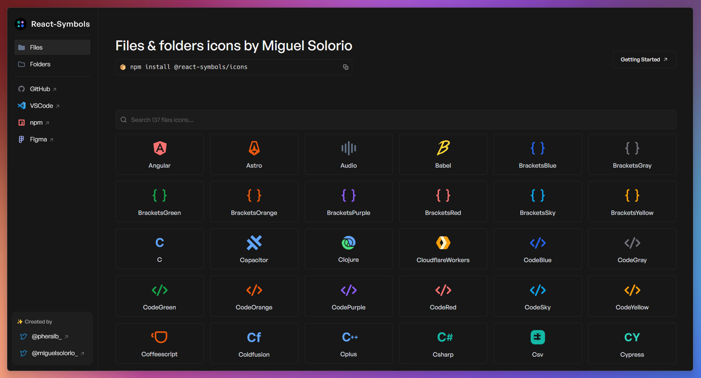

<div align="center">
<a href="https://react-symbols.vercel.app/">

</a>

<p></p>

<a href="https://react-symbols.vercel.app/">Explore</a>
<span>&nbsp;&nbsp;❖&nbsp;&nbsp;</span>
<a href="#-getting-started">Getting Started</a>
<span>&nbsp;&nbsp;❖&nbsp;&nbsp;</span>
<a href="#-license">License</a>
<span>&nbsp;&nbsp;❖&nbsp;&nbsp;</span>
<a href="https://marketplace.visualstudio.com/items?itemName=miguelsolorio.symbols">VSCode Theme</a>


[](https://actions-badge.atrox.dev/pheralb/react-symbols/goto?ref=main)


</div>

## 👋 Introduction

[**React-Symbols**](https://react-symbols.vercel.app/) is a library for React with the icons of the VSCode theme ["Symbols"](https://marketplace.visualstudio.com/items?itemName=miguelsolorio.symbols) by [Miguel Solorio (@miguelsolorio)](https://github.com/miguelsolorio):

- **+100** files & folders icons.
- Support React Server Components (RSC) & Next.js 13/14 /app directory.
- **Lightweight**.
- Ready to use with **Typescript**.
- **SVG optimized** and **minified**.

## 🚀 Getting Started

> React-Symbols require **React >=16.8.0**.

### - Install

```bash
# with npm:
npm install @react-symbols/icons

# with pnpm:
pnpm add @react-symbols/icons

# with ultra:
ultra install @react-symbols/icons

# with yarn:
yarn add @react-symbols/icons
```

### - Usage

```jsx
import { Angular, Astro, Document } from "@react-symbols/icons";

const MyComponent = () => {
  return (
    <>
      <Angular width={128} height={128} />
      <Astro width={128} height={128} />
      <Document width={128} height={128} />
    </>
  );
};

export default MyComponent;
```

> Config for use the library with [**Remix Old Compiler**](https://remix.run/) if you are using CJS (v1 uses CJS by default, v2 uses ESM):

```js
// Add in the remix.config.js:
module.exports = {
  ...
  serverDependenciesToBundle: ["@react-symbols/icons"],
  ...
};
```

> Change the name of the icon:

```jsx
import { Bun as BunIcon } from "@react-symbols/icons";

const MyComponent = () => {
  return (
    <>
      <BunIcon width={128} height={128} />
    </>
  );
};

export default MyComponent;
```

## ⚙️ Stack

This is a [Turborepo](https://turbo.build/repo) project bootstrapped with [`create-turbo`](https://www.npmjs.com/package/create-turbo):

**For library:**

- [SWC](https://swc.rs/) - Rust-based platform for the Web.
- [tsup (alternative)](https://tsup.egoist.dev/) - The simplest and fastest way to bundle your TypeScript libraries.
- [React](https://reactjs.org/) - A JavaScript library for building user interfaces.
- [Typescript](https://www.typescriptlang.org/) - TypeScript is JavaScript with syntax for types.

**For website:**

- [Remix](https://remix.run/) - Create modern, resilient user experiences with web fundamentals.
- [Typescript](https://www.typescriptlang.org/) - TypeScript is JavaScript with syntax for types.
- [Tailwind CSS](https://tailwindcss.com/) - A utility-first CSS framework for rapidly building custom designs.
- [tailwindcss-animate](https://github.com/jamiebuilds/tailwindcss-animate) - A Tailwind CSS plugin for creating beautiful animations.
- [shadcn/ui + Radix UI](https://ui.shadcn.com/) - An opinionated toast component for React.
- [Sonner](https://sonner.emilkowal.ski/) - An opinionated toast component for React.

## 🙌 Contributing

<a href="https://github.com/pheralb/react-symbols/graphs/contributors">
  
</a>

<p></p>

## 🔑 License

- [MIT](https://github.com/pheralb/react-symbols/blob/main/LICENSE).
